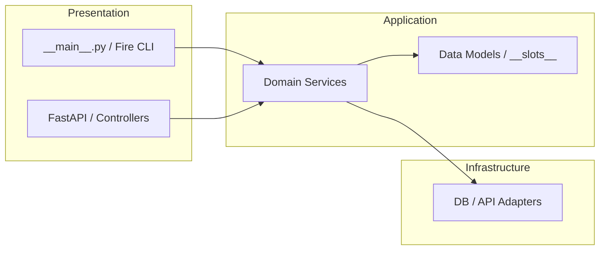
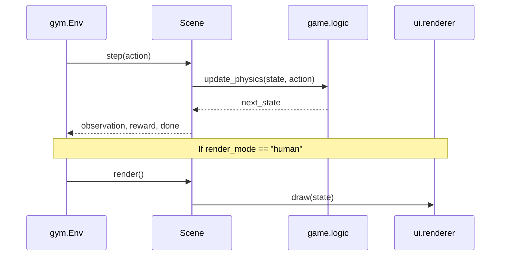
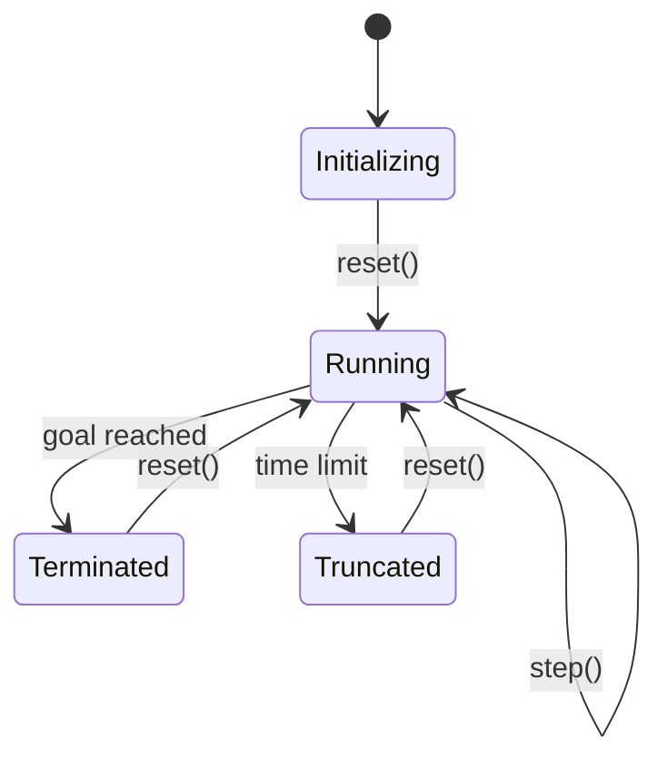

# Mermaid.js Documentation Standards

Use Mermaid.js for all architecture, sequence, and flowchart diagrams within Markdown files. This ensures diagrams are version-controlled and rendered natively in the browser.

## 1. General Styling

- **Theme**: Use `theme: neutral` or `theme: base` for professional clarity.
- **Direction**:
    - **Flowcharts**: Prefer `TD` (Top-Down) for processes and `LR` (Left-to-Right) for system architectures.
    - **Sequence Diagrams**: Use participant aliases for cleaner code.

## 2. Architecture Diagrams (C4 Light)

Use flowcharts to represent the Hexagonal Architecture layers.



## 3. Sequence Diagrams (Scene Pattern)

Use sequence diagrams to illustrate the coordination between Scenes, Logic, and Renderers.



## 4. State Machines (Scene Transitions)

Use state diagrams for Scene status or RL phase transitions.



## 5. Integration

Include Mermaid diagrams directly in `README.md`, `SKILL.md`, or ADRs. Always wrap them in a code block:

```text
 {backtick}{backtick}{backtick}mermaid
 graph TD;
     A-->B;
 {backtick}{backtick}{backtick}
```
